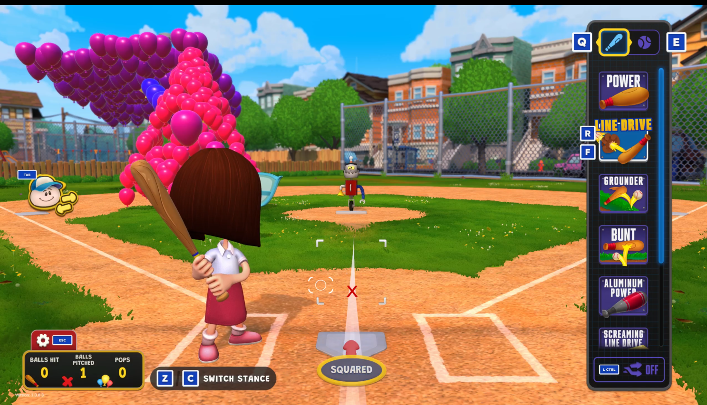
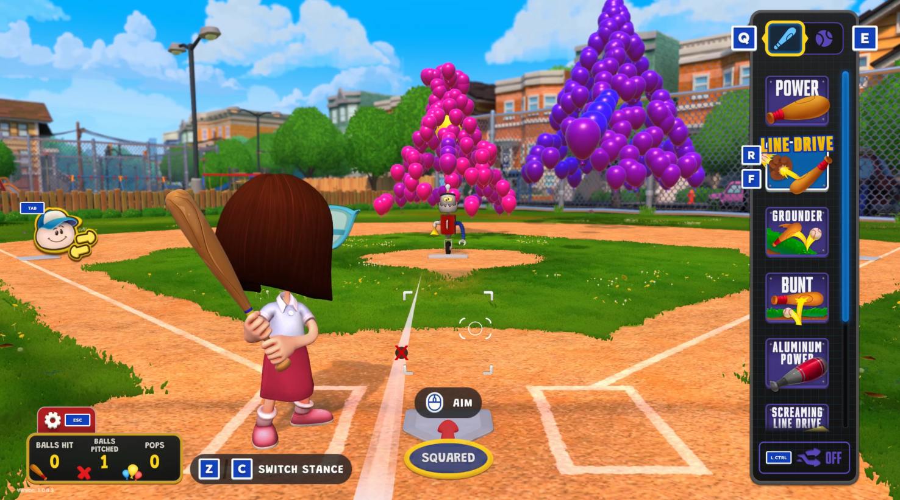

# Pitch Locator (Old School)

A mod for **Backyard Baseball 2026** that brings back the classic read-aid from the
original games: a red **X** that marks where each pitch crossed the plate.

When you take a pitch or swing and miss, an **X** appears at the spot the ball passed
through the strike zone. It stays up through the result, then clears once the pitcher
has the ball back and is ready for the next pitch — just like the old-school games.

*Nothing changes about the game's own files — this is a drop-in plugin that adds an
overlay on top. Delete it and the game is exactly as it was.*

## Screenshots

*With the aim assist on, the X snaps onto the aim circle that players read as the pitch's sweet spot — since a curveball physically curves away from it:*

---

## Requirements

- **Backyard Baseball 2026** (Steam). Built and tested against game build **1.0.8.3**.
- **BepInEx 5.4.x (Mono, x64)** — the mod loader this plugin runs on.
  Get it from the official BepInEx releases: https://github.com/BepInEx/BepInEx/releases
  (download the **BepInEx_win_x64_5.4.x** build — *not* the IL2CPP one).

## Installation

1. **Install BepInEx** (if you don't have it yet):
   - Download BepInEx 5.4.x (Mono, x64) from the link above.
   - Unzip its contents into your game folder — the one that contains
     `Backyard Baseball.exe`:
     `...\steamapps\common\Backyard Baseball 2026\`
   - Launch the game once, then close it. This generates BepInEx's folders.
2. **Install this mod:**
   - Drop `BackyardPitchLocator.dll` into:
     `...\steamapps\common\Backyard Baseball 2026\BepInEx\plugins\`
   - (A subfolder like `BepInEx\plugins\PitchLocator\` is fine too.)
3. **Launch the game.** You'll see the X appear on pitches you take or miss.

> **Tip:** back up nothing needed — this mod never edits game files. To uninstall,
> just delete the DLL (see below).

## Configuration

After you run the game once with the mod installed, a settings file is created at:

`...\BepInEx\config\com.flami.pitchlocator.cfg`

Open it in any text editor. Options (under the `[Pitch Locator]` section):

| Setting | Default | What it does |
|---|---|---|
| `Enabled` | `true` | Turn the X on/off. |
| `Color` | `#CC0000` | X color as an HTML hex code (deep red by default). |
| `FontSize` | `45` | On-screen size of the X (20–240). |
| `Outline` | `true` | Dark outline behind the X so it stays readable on any field. |
| `AnchorToAimAssist` | `true` | Places the X on the aim circle (the "sweet spot" you read as the pitch location). Turn **off** to mark the ball's exact physical crossing point instead — note a curveball's true path lands offset from the circle. |
| `OffsetX` / `OffsetY` | `0` | Fine-tune nudge in world units, only if the X sits slightly off for you. |

Edit and save, then relaunch the game to apply.

## Uninstall

Delete `BackyardPitchLocator.dll` from `BepInEx\plugins\`. That's it — the game is
back to stock. (You can also delete `com.flami.pitchlocator.cfg` from `BepInEx\config\`
if you want to clear your settings.)

## Notes & compatibility

- **Single-player / local play recommended.** 
- Works alongside other BepInEx plugins; it runs on its own and doesn't touch other mods.
- If a game update changes things and the X stops appearing, it's likely the update
  moved something internally — check for a new version of the mod.

## Disclaimer

This is an unofficial, fan-made mod. It is **not affiliated with, endorsed by, or
supported by** the developers or publisher of Backyard Baseball 2026. Use at your own
risk. This mod adds an overlay only and does not modify, redistribute, or include any
of the game's files or assets.

## License

Released under the MIT License — see `LICENSE.txt`. The mod's own code is free to use,
learn from, and build on.
