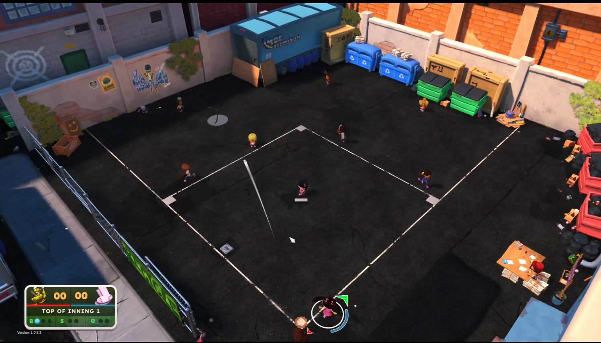
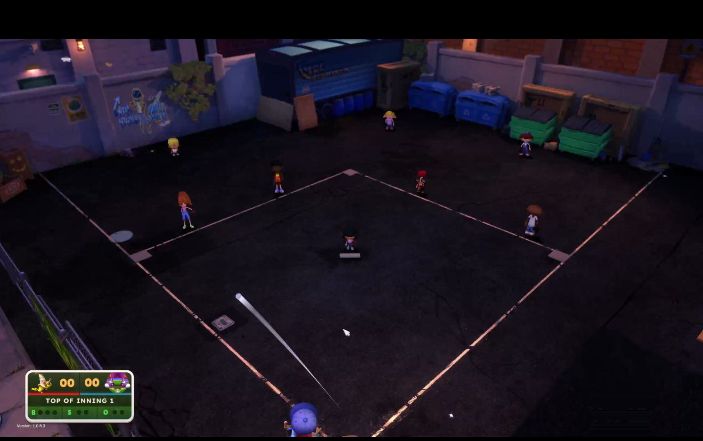

# VISLandingIndicator

A mod for **Backyard Baseball 2026** that keeps the fielding **"where the ball will
land" indicator** visible on night maps. ("VIS" = visibility.)

On night fields — and dark-surface fields like Tin Can Alley — the landing circle
blends into the ground and gets hard to see. The game already lightens its *sister*
element (the batting prediction reticle) at night, but never applied the same fix to
the fielding landing indicator. This mod does: it lightens the landing circle to match
the game's own night reticle color, so you can always see where a fly ball is coming down.

*This is a runtime tint only — it changes no game files and no game assets. Delete it
and the game is exactly as it was.*

## Screenshots

---

## Requirements

- **Backyard Baseball 2026** (Steam). Built and tested against game build **1.0.8.3**.
- **BepInEx 5.4.x (Mono, x64)** — the mod loader this plugin runs on.
  Get it from the official BepInEx releases: https://github.com/BepInEx/BepInEx/releases
  (download the **BepInEx_win_x64_5.4.x** build — *not* the IL2CPP one).

## Installation

1. **Install BepInEx** (if you don't have it yet):
   - Download BepInEx 5.4.x (Mono, x64) from the link above.
   - Unzip its contents into your game folder — the one that contains
     `Backyard Baseball.exe`:
     `...\steamapps\common\Backyard Baseball 2026\`
   - Launch the game once, then close it. This generates BepInEx's folders.
2. **Install this mod:**
   - Drop `VISLandingIndicator.dll` into:
     `...\steamapps\common\Backyard Baseball 2026\BepInEx\plugins\`
   - (A subfolder like `BepInEx\plugins\VISLandingIndicator\` is fine too.)
3. **Launch the game.** On a night map, hit a fly ball — the landing circle now stays visible.

## Configuration

After running the game once with the mod installed, a settings file is created at:

`...\BepInEx\config\com.flami.vislandingindicator.cfg`

Options (under the `[Landing Indicator]` section):

| Setting | Default | What it does |
|---|---|---|
| `Enabled` | `true` | Master on/off. |
| `ApplyOnNightMaps` | `true` | Lighten the indicator on any night map. |
| `Brightness` | `0.75` | Gray level of the lightened circle (0 = black, 1 = white). `0.75` matches the game's own night reticle color. |
| `DarkFields` | `Tin Can Alley, Cement Gardens` | Comma-separated field names that always use the light circle, even in daytime (for dark asphalt fields). Matching is case/space-insensitive and partial. |

**Finding a field's exact name:** the mod logs the field it sees to
`...\BepInEx\LogOutput.log` (look for `[Reticle] Field='...'`). Copy that name into
`DarkFields` if you want a specific daytime field always lightened.

Edit and save, then relaunch the game to apply.

## Uninstall

Delete `VISLandingIndicator.dll` from `BepInEx\plugins\`. That's it — the landing
indicator goes back to its stock look.

## Notes & compatibility

- **Single-player / local play recommended.** 
- Purely visual — it only tints the indicator's color and never touches your saves.
- Works alongside other BepInEx plugins.
- If a game update changes the landing indicator internally and the tint stops applying,
  the update likely moved something — check for a new version of the mod.

## Disclaimer

This is an unofficial, fan-made mod. It is **not affiliated with, endorsed by, or
supported by** the developers or publisher of Backyard Baseball 2026. Use at your own
risk. This mod adjusts an on-screen color at runtime and does not modify, redistribute,
or include any of the game's files or assets.

## License

Released under the MIT License — see `LICENSE.txt`. The mod's own code is free to use,
learn from, and build on.
